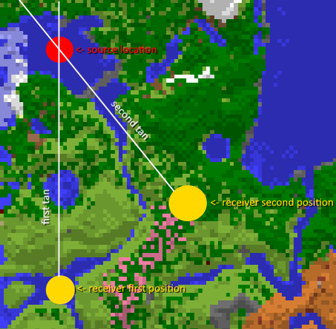

# gyro

Abuses the newly introduced (1.21.6) Minecraft waypoint system to get player positions.

## Downloads

- [GitHub Releases](https://github.com/VidTu/gyro/releases)

## Dependencies

This mod has _no required dependencies_, besides the loader and the game.
You'll need:

- Fabric Loader
- Minecraft (25w20a)
- Optional: Fabric API ("Fabric Resource Loader" module)

Fabric API is **NOT** required, but you can install it for localization support.

## About

Minecraft 1.21.6[^1] (25w15a) added a new player locator bar. Mojang made the smart decision NOT to send other players'
locations directly to everyone on the server, instead opting for a more secure system. The senders of waypoints
are called "*sources*" (not an official name), and the receivers are called "*receivers*." (not an official name, too)
The waypoint sending process is called a "*connection*" (that's actually an official name). This system works like this:

1. If the *receiver* can directly see the chunk in which the *source* is located, the whole X/Y/Z position is sent
   directly to the client. This is called a *vector position* or a *vec3i position* (for "vector, 3 integers").
   This can be easily obtained by any packet listener just by getting the X/Y/Z from the packet. This is precise.
2. Otherwise, if the *receiver* is located "*not really far away*" (an official term, which means the player is located
   within the `far_dist` waypoint property, 332 blocks by default) from the *source*, they receive only the chunk
   position where the *source* is located. This is called a *chunk position*. This loses some information
   but allows us to find the *source*'s chunk, and from there the *vector position* will allow us to find the *source*.
3. If the *receiver* is located *really far away*, the angle (aka yaw, aka the rotation) between the *source* and the
   *receiver* is calculated server-side and sent to the client. That loses all valuable information from this,
   and it shouldn't be possible to recover the player position, right?

Actually, nope. We can use some basic trigonometry already used by the speedrunning community to find strongholds
if we assume that the *source* is standing still or doesn't move too much. The *receiver* can move around a bit,
calculate the two tans and find their crossing point, and can pretty much find the exact *source* location.
See this image[^2], if you're confused about how this works:



## FAQ

**Q**: I need help, have some questions, or have some other feedback.  
**A**: You can join the [Discord server](https://discord.gg/Q6saSVSuYQ).

**Q**: Where can I download this mod?  
**A**: [GitHub Releases](https://github.com/VidTu/gyro/releases).
You can also find unstable builds at [GitHub Actions](https://github.com/VidTu/gyro/actions).
You'll need a GitHub account to download these.

**Q**: Which mod loaders are supported?  
**A**: Fabric is supported. Quilt should work too.

**Q**: Which Minecraft versions are supported?  
**A**: Minecraft 25w19a. (a snapshot for 1.21.6[^1])

**Q**: Do I need to install Fabric API or Quilt Standard Libraries?  
**A**: No, but you can install these for other mods and/or localization support.

**Q**: Is this mod open source?  
**A**: [Yes.](https://github.com/VidTu/gyro) (Licensed
under [MIT License](https://github.com/VidTu/gyro/blob/main/LICENSE))

**Q**: Is this mod client-side or server-side?  
**A**: This mod works on the client-side.

**Q**: Is this a hack?  
**A**: It is a proof of concept. This can be counted as hack depending on your opinion on what's hack and what's not.

**Q**: I've found a bug.  
**A**: Report it [here](https://github.com/VidTu/gyro/issues). If you are not sure whether this is a bug or a
simple question, you can join the [Discord](https://discord.gg/Q6saSVSuYQ).
Report security vulnerabilities [here](https://github.com/VidTu/gyro/security).

**Q**: Can I use this in my modpack?  
**A**: Sure. Credit (e.g., a link to mod's GitHub page) is appreciated, but is not required.
Monetization and redistribution are allowed as per the [MIT License](https://github.com/VidTu/gyro/blob/main/LICENSE).
Beware: This mod may be considered a hack by some people.

**Q**: Why is this mod not on the Modrinth or CurseForge?  
**A**: It is a proof of concept and may be also considered a hack by these platforms.

## License

This project is provided under the MIT License.
Check out [LICENSE](https://github.com/VidTu/gyro/blob/main/LICENSE) for more information.

## Development

### Building (Compiling)

To compile the mod from the source code:

1. Have 4 GB of free RAM, 10 GB of free disk space, and an active internet connection.
2. Install Java 21 and dump it into PATH and/or JAVA_HOME.
3. Run `./gradlew assemble` from the terminal/PowerShell.
4. Grab the JAR from the `./build/libs/` folder.

### Developing/Debugging

Run the `./gradlew runClient` command to launch the game client. You can attach a debugger to that process.
Hotswap is supported. "Enhanced" hotswap (class redefinition) and hotswap agent will work if supported by your JVM.

Running the client via generated tasks (e.g., for IntelliJ IDEA) may work, but you might need to make some adjustments.
Launching the game directly (without Gradle) might also work, but it is also not supported.

The development environment has stricter preconditions: Mixin checks, Netty detector, Java assertions, etc.
Code with bugs might (and probably will) fail faster here than in a production environment.

The recommended IDE for development is IntelliJ IDEA (Community or Ultimate) with the Minecraft Development plugin.
This is not a strict requirement, however. Any IDE/editor should work just fine.

### Reproducible Builds

gyro attempts to have reproducible builds (reproducible JAR archives) for its releases. Check out
[GitHub Releases](https://github.com/VidTu/gyro/releases) for "Reproducible Build Hash" values. If it is present
on any release, this release's binary JAR should be reproducible. Unfortunately, due to the nature of Java
(Gradle) and Minecraft development, it is not always possible to have reproducible builds.
Reproducible release JARs are compiled with: (use these commands to create a reproducible build)

```bash
./gradlew clean --no-daemon --no-build-cache --no-configuration-cache
./gradlew assemble --no-daemon --no-build-cache --no-configuration-cache
```

Currently, no dependency (integrity) validation is performed. This might change in a future version.

[^1]: Not yet confirmed to be 1.21.6.

[^2]: Background map from [minecraft.wiki](https://minecraft.wiki/index.php?curid=122350).
